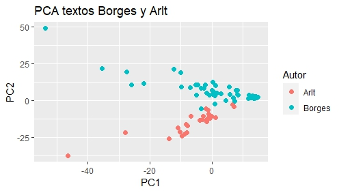

# Introducción-a-NLP-español-Borges-y-Arlt
Usamos a modo de ejemplo textos de Borges y Arlt para aplicar técnicas básicas de procesamiento del lenguaje natural a textos en español. El conjunto de datos utilizado en este proyecto fue obtenido de [este repositorio](https://github.com/karen-pal/borges). En el script [Borges-Arlt-Script.R](Borges-Arlt-Script.R)
 encontramos las siguientes acciones:

1. Importamos los corpus de textos.
2. Vemos los términos más utilizados con y sin stopwords.
3. Armamos la matriz de frecuencias realizando ciertos filtros.
4. Hacemos PCA sobre la matriz de frecuencia y visualizamos.

Observemos que se separan de forma muy marcada los textos de cada autor, sobre todo en el eje y. A la derecha del eje x vemos que se acumulan textos de Borges, cabe resaltar que estos corresponden a poemas, mientras que el resto corresponden a cuentos. Esto sugiere utilizar la matriz reducida para la clasificación:

5. Hacemos KNN para clasificar textos por autor sobre la matriz comprimida. Haciendo un split train-test de 80-20 obtenemos una tasa de acierto del 100% (lo cual es esperable con la separación mostrada en el gráfico de PCA)

